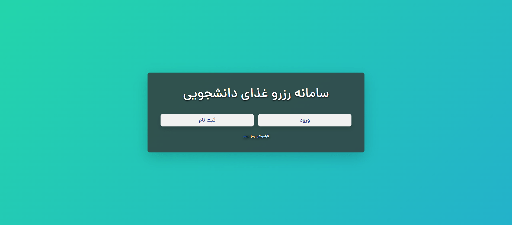
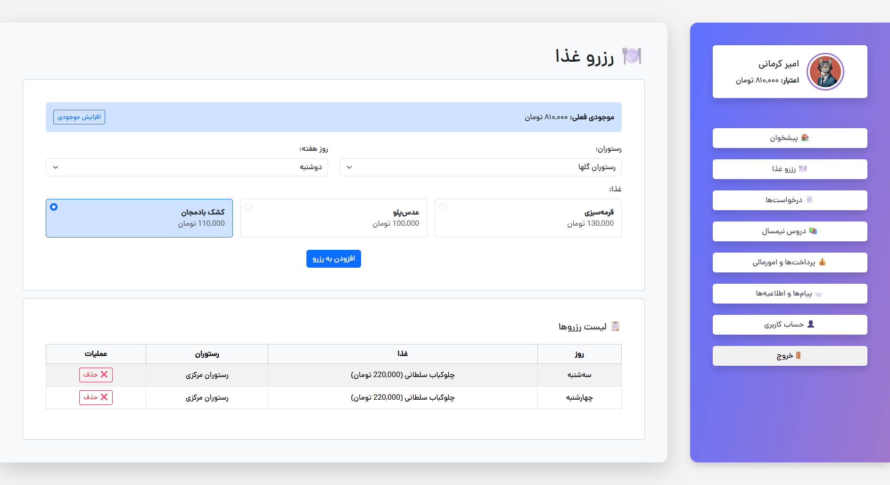
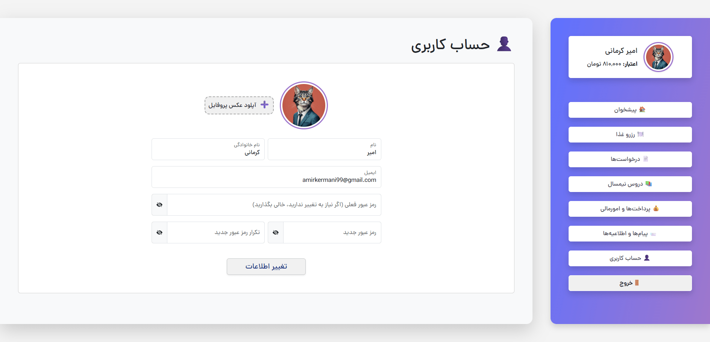
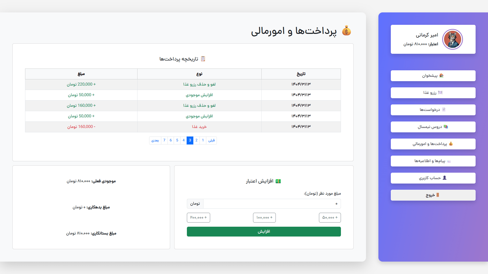

# سامانه رزرو آنلاین غذا

یک پروژه وب اپلیکیشن برای مدیریت و رزرو آنلاین غذا که با استفاده از پلتفرم Node.js و فریم‌ورک Express.js توسعه داده شده است. این سامانه به کاربران اجازه می‌دهد تا به راحتی غذاهای مورد علاقه خود را مشاهده، انتخاب و رزرو کنند.


> **📌 توجه داشته باشید که این پروژه، یک پروژه تست و دمو است و بسیاری از بخش های آن هنوز توسعه نیافته**


# لیست محتوا
- [🎯 هدف پروژه](#🎯-هدف-پروژه)
- [✨ ویژگی‌ها](#✨-ویژگی‌ها)
- [📸 پیش‌نمایش](#📸-پیش‌نمایش)
- [🛠️ تکنولوژی‌های استفاده شده](#🛠️-تکنولوژی‌های-استفاده-شده)
- [📂 ساختار فایل‌ها و پوشه‌ها](#📂-ساختار-فایل‌ها-و-پوشه‌ها)
- [🚀 راه‌اندازی و نصب (به صورت لوکال)](#🚀-راه‌اندازی-و-نصب-به-صورت-لوکال)
- [🐳 راه‌اندازی با استفاده از داکر](#🐳-راه‌اندازی-با-استفاده-از-داکر)
- [🤝 مشارکت](#🤝-مشارکت)
- [💬 ارسال بازخورد](#💬-ارسال-بازخورد)
- [📄 لایسنس](#📄-لایسنس)


## 🎯 هدف پروژه

هدف اصلی این پروژه، ارائه یک پلتفرم ساده، کارآمد و قابل توسعه برای رستوران‌ها یا سازمان‌هایی است که نیاز به یک سیستم متمرکز برای مدیریت فرآیند سفارش و رزرو غذا دارند. معماری پروژه به صورت ماژولار طراحی شده تا امکان افزودن ویژگی‌های جدید در آینده به سادگی فراهم باشد.

## ✨ ویژگی‌ها

**ویژگی‌های عمومی و کاربری:**

  * 🔐 **سیستم احراز هویت:** ثبت‌نام، ورود و خروج امن کاربران.
  * 📜 **مشاهده منوی غذا:** نمایش لیست کامل غذاها به همراه جزئیات و قیمت.
  * 🛒 **فرآیند رزرو:** امکان افزودن غذا به سبد خرید و نهایی کردن رزرو برای روز مشخص.
  * 👤 **پروفایل کاربری:** مشاهده و ویرایش اطلاعات کاربری.
  * 📊 **تاریخچه رزروها:** نمایش لیست رزروهای قبلی و وضعیت آن‌ها.

## 📸 پیش‌نمایش

در ادامه چند تصویر از رابط کاربری سامانه رزرو آنلاین غذا مشاهده می‌کنید:
| صفحه اصلی | صفحه رزرو غذا |
|---------------|-----------------------------|
|  |  |

| حساب کاربری | پرداخت‌ها و امورمالی |
|----------------|----------------|
|  |  |


## 🛠️ تکنولوژی‌های استفاده شده

  * **سمت سرور (Backend):** Node.js, Express.js
  * **پایگاه داده (Database):** MongoDB (با استفاده از Mongoose به عنوان ODM)
  * **قالب‌سازی (Templating):** EJS (Embedded JavaScript)
  * **سمت کاربر (Frontend):** HTML, CSS, Bootstrap 5, JavaScript
  * **احراز هویت (Authentication):** JWT
  * **کانتینرسازی (Containerization):** Docker, Docker Compose

## 📂 ساختار فایل‌ها و پوشه‌ها

ساختار پروژه به صورت ماژولار و بر اساس الگوی MVC (Model-View-Controller) طراحی شده است تا خوانایی و نگهداری کد ساده‌تر باشد.

```
/
├── config/             # فایل‌های پیکربندی پروژه (مانند اتصال به پایگاه داده)
├── controllers/        # منطق اصلی برنامه و کنترل‌کننده‌ها
├── middlewares/        # میان‌افزارها (مانند بررسی احراز هویت)
├── models/             # مدل‌ها و اسکیمای پایگاه داده (Mongoose Schemas)
├── public/             # فایل‌های استاتیک (CSS, JS, تصاویر)
├── routes/             # مسیرها و اندپوینت‌های برنامه (App Routes)
├── services/           # سرویس‌های جانبی (مانند افزایش موجودی)
├── utils/              # ابزارها و توابع کمکی
├── views/              # فایل‌های قالب (EJS Templates)
│   ├── includes/       # فایل‌های قابل استفاده مجدد (مانند هدر و فوتر)
│   └── ...
├── .dockerignore       # نادیده گرفتن فایل‌ها در هنگام ساخت ایمیج داکر
├── .gitignore          # نادیده گرفتن فایل‌ها توسط گیت
├── Dockerfile          # دستورالعمل‌های ساخت ایمیج داکر پروژه
├── docker-compose.yml  # تعریف و اجرای سرویس‌های داکر (اپلیکیشن و پایگاه داده)
├── package.json        # اطلاعات پروژه و لیست وابستگی‌ها
├── package-lock.json   # قفل کردن نسخه‌های وابستگی‌ها
├── seed.js             # اسکریپت برای افزودن داده‌های اولیه به پایگاه داده
└── server.js           # نقطه شروع و فایل اصلی اجرای سرور
```

## 🚀 راه‌اندازی و نصب (به صورت لوکال)

برای راه‌اندازی این پروژه به صورت لوکال، مراحل زیر را دنبال کنید:

>📌 *ابتدا مطمئن شوید که روی دستگاه خود MongoDB را نصب دارید. درغیر اینصورت می‌توانید برای اجرای برنامه به مرحله [🐳 راه‌اندازی با استفاده از داکر](#🐳-راه‌اندازی-با-استفاده-از-داکر) مراجعه کنید.*

1.  **کلون کردن پروژه:**

```
git clone https://github.com/1AmiraK1/food-reservation.git
cd food-reservation
```

2.  **نصب وابستگی‌ها:**

    با استفاده از `npm` یا `yarn` تمام پکیج‌های مورد نیاز را نصب کنید.

```
npm install
```

3.  **تنظیمات محیطی:**
    
    متغیرهای محیطی مورداستفاده در این برنامه:

    `JWT_SECRET` = کلید مخفی JWT

    `SESSION_SECRET` = کلید مخفی سشن

    `APP_PORT` = پورت اجرای برنامه (پورت پیشفرض 3000 است.)
    
    `MONGO_URI` = مسیر اتصال برنامه به MongoDB (استفاده شده در config>db.js)

   برای تغییر این متغیرها در مسیر اصلی برنامه یک فایل به اسم `.env` بسازید و متغیرها را به مانند مثال  زیر وارد کنید:


    APP_PORT=3001
    MONGO_URI=mongodb://localhost:27017/food-reservation
    JWT_SECRET=your-secret-key
    SESSION_SECRET=your-secret-key

4.  **تزریق داده‌های اولیه (Seeding):**
    برای افزودن داده‌های اولیه (مانند لیست رستوران‌ها یا لیست غذاها) به پایگاه داده، اسکریپت `seed` را اجرا کنید.

```
npm run seed
```

5.  **اجرای پروژه:**

```
npm start
```
*برای اجرای همزمان دستورات 4  و 5 میتوانید از دستور `npm run deploy` نیز استفاده کنید.*

6. پروژه در آدرس `http://localhost:3000` در دسترس خواهد بود.

>📌 *در صورتی که در مرحله 3 ، مقدار APP_PORT را معین کرده باشید، پروژه در آدرس `http://localhost:APP_PORT` اجرا خواهد شد.*


## 🐳 راه‌اندازی با استفاده از داکر

>📌 *قبل از راه اندازی با استفاده از داکر، مطمئن شوید که برنامه داکر بر روی دستگاه شما نصب و درحال اجرا است.*

این پروژه به طور کامل با داکر سازگار است و می‌توانید آن را به راحتی با دستور زیر راه‌اندازی کنید:

1.  **ساخت و اجرای کانتینرها:**
    این دستور ایمیج‌های لازم را ساخته و کانتینرهای اپلیکیشن و پایگاه داده را به صورت همزمان اجرا می‌کند.

```
docker compose up -d
```
>📌 *توجه داشته باشید که این دستور را در مسیر اصلی برنامه جایی که فایل `docker-compose.yml` قرار دارد، اجرا کنید.*

2. **توقف و حذف کانتینرها:**  برای توقف سرویس‌ها از دستور زیر استفاده کنید:

```
docker compose down
```

## 🤝 مشارکت

همان‌طور که در ابتدا اشاره شد، این پروژه در حال حاضر یک نسخه آزمایشی و دمو است و ممکن است همه ویژگی‌های مورد نیاز شما را در بر نداشته باشد. خوشحال می‌شویم اگر تمایل به توسعه یا بهبود این پروژه دارید، با ما همراه شوید و در مسیر ارتقا و تکمیل آن مشارکت کنید. هرگونه پیشنهاد، بازخورد یا همکاری شما بسیار ارزشمند خواهد بود.

## 💬 ارسال بازخورد

ما همیشه به دنبال بهبود این پروژه هستیم و بازخوردهای شما برای ما بسیار ارزشمند است.

اگر هنگام استفاده از سامانه به مشکلی برخوردید، پیشنهادی برای بهبود عملکرد داشتید یا حتی اگر فقط خواستید نظرتان را با ما در میان بگذارید، لطفاً از یکی از روش‌های زیر اقدام کنید:

- ایجاد یک [Issue جدید در GitHub](https://github.com/1AmiraK1/food-reservation/issues)
- ارسال Pull Request برای اصلاح یا افزودن قابلیت
- amirkermani99@gmail.com

با مشارکت شما، این پروژه می‌تواند کامل‌تر، کاربردی‌تر و پایدارتر شود. 🙌

## 📄 لایسنس

این پروژه تحت مجوز [MIT License](https://opensource.org/licenses/MIT) منتشر شده است.
